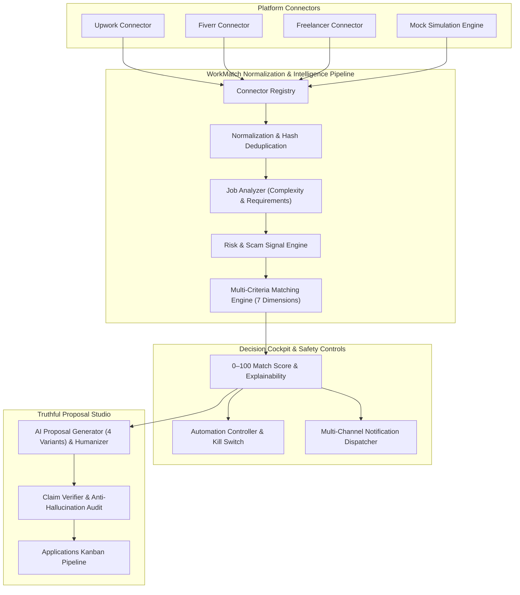

<div align="center">

# WorkMatch AI

### Multi-Platform Work Opportunity Discovery, Decision Intelligence & Proposal Suite

[](https://www.typescriptlang.org/)
[](https://react.dev/)
[](https://nodejs.org/)
[](https://vitejs.dev/)
[](https://tailwindcss.com/)
[](https://github.com/Ashaypatakare04/WorkMatch)
[](LICENSE)

<p align="center">
  <b>Harmonize heterogeneous freelance marketplaces into a single, high-signal decision cockpit.</b><br/>
  Mathematical multi-criteria fit scoring, automated scam/risk detection, and hallucination-free proposal generation.
</p>

[Key Features](#key-features) • [Architecture](#system-architecture) • [Quick Start](#quick-start) • [Safety Controls](#enterprise-safety--guardrails) • [Documentation](#documentation)

---

</div>

## Overview

Freelancers and boutique agencies waste dozens of hours every week wading through low-budget bids, platform-violating scams, and ill-fitting job listings scattered across Upwork, Fiverr, and Freelancer.

**WorkMatch AI** solves this with an intelligent decision-support suite:
1. **Aggregates and Normalizes**: Ingests opportunities across multiple platforms into a unified, deduplicated data model.
2. **Scores Mathematical Fit (0–100)**: Evaluates jobs against the freelancer's verified skills, rate floors, availability, and difficulty preferences.
3. **Flags Risks & Scams**: Automatically catches off-platform communication (Telegram/WhatsApp), upfront fee demands, and client hire-rate anomalies.
4. **Drafts Truth-Checked Proposals**: Synthesizes 4 distinct proposal angles with a **strict Claim Verification firewall** that eliminates AI hallucinations and prevents exaggerated experience claims.
5. **Enforces Strict Safety Guardrails**: Includes daily/hourly rate limiters, spending caps, and a prominent **Emergency Kill Switch**.

---

## System Architecture



---

## Key Features

### 1. Multi-Platform Harmonization & Deduplication
- **Universal Schema**: Normalizes disparate marketplace feeds (hourly vs. fixed budgets, client ratings, skill tags) into a standardized `NormalizedJob` format.
- **SHA-256 Deduplication**: Content-aware hashing eliminates cross-posted duplicates across boards.
- **Capability Matrix**: Explicitly honors platform API policies (e.g. read-only discovery vs. programmatic applications).

### 2. Multi-Criteria Matching Engine (0–100 Scale)
Every opportunity is evaluated across 7 weighted dimensions:
* **Skill Overlap (30%)**: Bidirectional substring matching against verified profile skills.
* **Preference Fit (20%)**: Target categories alignment and negative keyword penalties.
* **Difficulty & Ease (20%)**: Cognitive load, duration, and technical complexity.
* **Budget Floor (15%)**: Remuneration viability relative to user's minimum hourly or fixed rate.
* **Client Quality (15%)**: Historical client rating, review count, and payment credibility.
* **Safety Caps**: Any job with user-excluded terms is hard-capped at **40/100**; High-risk jobs capped at **45/100**.

### 3. Truthful Proposal Studio & Anti-Hallucination Firewall
- **4 Tailored Writing Variants**: `Direct` (concise/outcome-focused), `Conversational` (friendly/rapport-building), `Technical` (milestones/architecture), and `Detailed` (comprehensive plan).
- **Humanizer Engine**: Strips robotic AI clichés (*"I hope this finds you well"*, *"testament to my skills"*).
- **Claim Verification Audit**: Dual-layer verification (deterministic RegEx + semantic prompt audit) checks every proposal against the user's declared profile.
  - Automatically flags and sanitizes inflated experience numbers.
  - Rejects mentions of unlisted technologies or unverified past employers.

### 4. Enterprise Safety & Guardrails
- **3 Operational Modes**:
  - `Manual`: Intelligence and decision support only.
  - `Assisted`: AI drafts proposals; human click required to submit.
  - `Automatic`: Autonomous submissions strictly governed by safety tripwires.
- **Global Emergency Kill Switch**: One-click instant tripwire halting all proposal generation across all channels with audit logging.
- **Rate Limiting**: Configurable daily caps, rolling 60-minute hourly limits, and Connect spend restrictions.

### 5. Bespoke Dual-Theme UI (Light & Dark)
- Designed with a bespoke **Linear / Vercel design system**.
- **Light Mode**: Crisp white surfaces (`bg-white`), slate delineation (`border-slate-200`), dark headings (`#0f172a`), jewel-tone emerald accents (`#047857`), and high-contrast badge washes.
- **Dark Mode**: Deep OLED slate canvas (`#07090e`), translucent glass panels, and ambient glows.
- **Retina Favicon & Concept 1 Logo**: Vector geometry featuring the *Nexus WM Arrow* with precision focus node.

### 6. Interactive Public Landing Page & Sandbox Simulator
- **Live Opportunity Match Cockpit**: Interactive 5-factor dimension breakdown bars.
- **Match Formula Simulator**: Real-time range sliders allowing freelancers to adjust scoring weights.
- **Proposal Studio Preview**: Interactive variant selector with fact-verification badges.
- **ROI Efficiency Calculator**: Instant estimation of time saved and win-rate improvement.

---

## Tech Stack

| Layer | Technologies |
|---|---|
| **Frontend** | React 19, TypeScript, Vite 6, Tailwind CSS, Lucide Icons |
| **Backend** | Node.js 22 LTS, TypeScript, Express 4, Zod, tsx |
| **Database** | SQLite (WAL mode, foreign keys enabled) & PostgreSQL (`pgMigrate.ts`) |
| **AI Gateway** | Modular Gateway supporting Mock NLP Engine (offline, zero-cost), Google Gemini, OpenAI |
| **Testing** | Node.js Built-in Test Runner (`tsx --test`), 67 passing automated test suites |
| **Styling** | Custom Glassmorphism, Tailwind Typography, Linear/Vercel Light & Dark Tokens |

---

## Quick Start

### Prerequisites
- **Node.js**: `v20.x` or `v22.x LTS` recommended
- **npm**: `v10+`

### 1. Clone & Install
```bash
git clone https://github.com/Ashaypatakare04/WorkMatch.git
cd WorkMatch

# Install backend dependencies
npm install --prefix backend

# Install frontend dependencies
npm install --prefix frontend
```

### 2. Configure Environment Variables
Create a `.env` file in `backend/` (optional, sensible defaults provided):
```env
PORT=4000
NODE_ENV=development
JWT_SECRET=your_super_secret_jwt_key
CORS_ORIGIN=http://localhost:5173
AI_PROVIDER=mock
```

### 3. Initialize Database Schema
```bash
npm run migrate --prefix backend
```

### 4. Start Development Servers
Open two terminal windows:

```bash
# Terminal 1: Backend API (http://localhost:4000)
npm run dev --prefix backend

# Terminal 2: Frontend Client (http://localhost:5173)
npm run dev --prefix frontend
```

### 5. Launch the 1-Click Interactive Sandbox
1. Open your browser at **`http://localhost:5173`**.
2. Click **"Launch Free Sandbox"** or **"Load 1-Click Demo Dataset"**.
3. Instantly test 30 normalized jobs across Upwork, Fiverr, and Freelancer with pre-computed match scores, risk flags, and proposal variants—no API keys required!

---

## Running Automated Tests

WorkMatch includes an extensive production readiness test suite covering normalization, multi-dimensional scoring, scam heuristics, claim verification, automation safety, and multi-user isolation.

```bash
# Run backend test suite (67 test suites)
npm test --prefix backend

# Verify frontend production compilation
npm run build --prefix frontend
```

---

## Directory Structure

```
WorkMatch/
├── backend/
│   ├── src/
│   │   ├── ai/
│   │   │   ├── analyzers/         # Technical complexity & requirements extraction
│   │   │   ├── gateway/           # AI Gateway (Mock, Gemini, OpenAI)
│   │   │   ├── matching/          # Multi-criteria scoring & DifficultyCalculator
│   │   │   ├── proposals/         # ClaimVerifier, Humanizer & ProposalGenerator
│   │   │   └── risk/              # RiskScamSignalEngine & scam heuristics
│   │   ├── api/
│   │   │   ├── middleware/        # JWT auth, error handler, security headers
│   │   │   └── routes/            # Jobs, Applications, Profile, Automation routes
│   │   ├── automation/            # AutomationController & safety rate limiters
│   │   ├── connectors/            # Upwork, Fiverr, Freelancer & Mock connectors
│   │   ├── database/              # SQLite connection, migrations, pgMigrate
│   │   ├── models/                # TypeScript data schemas & domain interfaces
│   │   ├── notifications/         # Multi-channel notification dispatchers
│   │   ├── repositories/          # Data access layer & SQL query repositories
│   │   ├── tests/                 # 67 automated test suites
│   │   └── workers/               # BackgroundWorker synchronization loop
│   └── package.json
│
├── frontend/
│   ├── public/
│   │   └── favicon.svg            # Retina-sharp Concept 1 vector favicon
│   ├── src/
│   │   ├── components/
│   │   │   ├── automation/        # Automation & safety boundary workbench
│   │   │   ├── common/            # Logo (Concept 1), ThemeToggle, ErrorBoundary
│   │   │   ├── dashboard/         # Central freelancer KPI cockpit
│   │   │   ├── jobs/              # JobsView & JobDetailsModal (Proposal Studio)
│   │   │   ├── landing/           # 16-section interactive landing page
│   │   │   └── layout/            # Navbar, Sidebar, MobileNav
│   │   ├── services/              # Centralized typed HTTP API transport client
│   │   ├── types/                 # Shared frontend domain TypeScript types
│   │   ├── App.tsx                # Application orchestrator & hash router
│   │   └── index.css              # Bespoke Light & Dark mode tokens
│   └── package.json
│
├── docs/                          # Comprehensive technical documentation
└── README.md                      # Project manual & documentation
```

---

## Documentation

Comprehensive architectural guides and specifications are available in [`/docs`](file:///docs):
* [System Architecture](file:///docs/ARCHITECTURE.md) — Detailed component workflows and data flow.
* [REST API Reference](file:///docs/API.md) — Complete endpoint definitions and request/response payloads.
* [Database Schema & Migrations](file:///docs/DATABASE.md) — Relational schema definitions and Postgres migration guide.
* [Platform Connector Guide](file:///docs/CONNECTOR_GUIDE.md) — How to implement new marketplace connectors.
* [AI Gateway & Prompts](file:///docs/AI.md) — Prompt engineering and structured schema outputs.
* [Security & Safety Policy](file:///docs/SECURITY.md) — Kill switch specifications, rate limiting, and data encryption.
* [Deployment Guide](file:///docs/DEPLOYMENT.md) — Docker, Vercel, and cloud production deployment instructions.
* [Academic Project Overview](file:///docs/project-overview.md) — High-level problem statement and design rationale.

---

## License

This project is licensed under the **MIT License** — see the [LICENSE](LICENSE) file for details.
